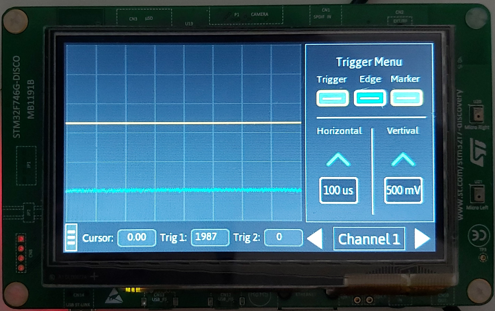

# Oscilloscope on STM32F746 Discovery kit
  

## Update

Since STMicroelectronics bought TouchGFX and integrate the graphical stack into the toolchain STM32CubeIDE, this application must be updated to the new toolchain.

## Motivation

This oscilloscope is built based on the STM32F746-DISCO kit from STMicroelectronics to demonstrate the processing capability of a Cortex-M7 Microcontroller.

The two main blocks of the application are ADC peripheral, which sampling data from the input and graphcal interface, which displays the data and provides a HMI. The graphical interface is built based on TouchGFX grpahical stack, which provide a mordern look and smartphone feel interface.

## Features

* 2 input channel
* Sampling rate 1 mega-sample/s per channel
* Maximum input voltage 3.3V
* Rising/Falling edge trigger
* Adjust voltage level, time scale
* Marker for signal mesurement

## Requirements

### Hardware

* STM32F746-DISCO Kit [link](https://www.st.com/en/evaluation-tools/32f746gdiscovery.html)

### Software

These tools are used for developing the application

* Microsoft Visual Studio (Graphical interface development)
* Keil (Embedded firmware development)
* STM32 ST-Link Utility (This tool is used for flasing the application)

## Flashing the application

* Start STM32 ST-Link utility, connect the board to PC, press **Connect to the target** button
* Drag and drop the binary file into ST-Link. Binary file is located in folder *Project/Oscilloscope/Binary*
* On the top menu bar, choose *External Loader -> Add External Loader -> Choose N25Q128A_STM32F746G-DISCO -> Click Validate*
* Click **Program verify**, click **Start**

## Project struture

* Project: source code of the project

  * Oscilloscope

    * Binary: binary file of the application
    * Firmware: source code of the firmware
    * Graphic: source code of the graphical interface
* touchgfx: TouchGFX stack

## Contact

For any information or feedback, please use Issues or drop me an email: hainguyen.eeit@gmail.com
